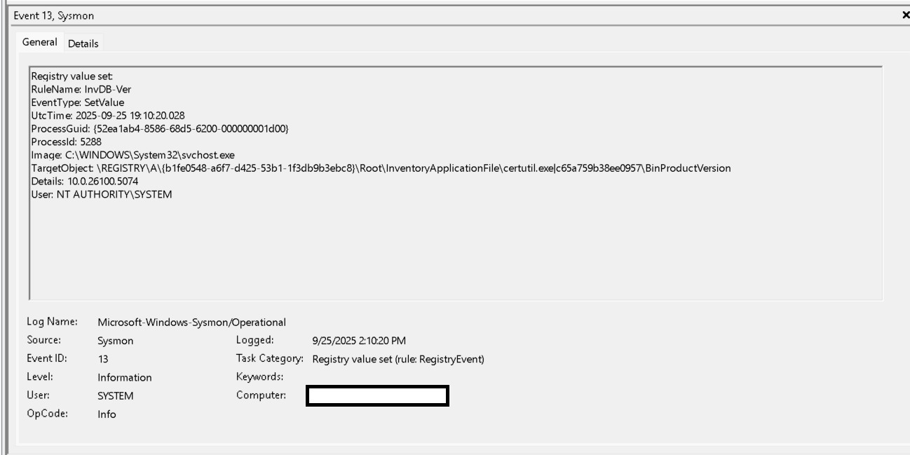
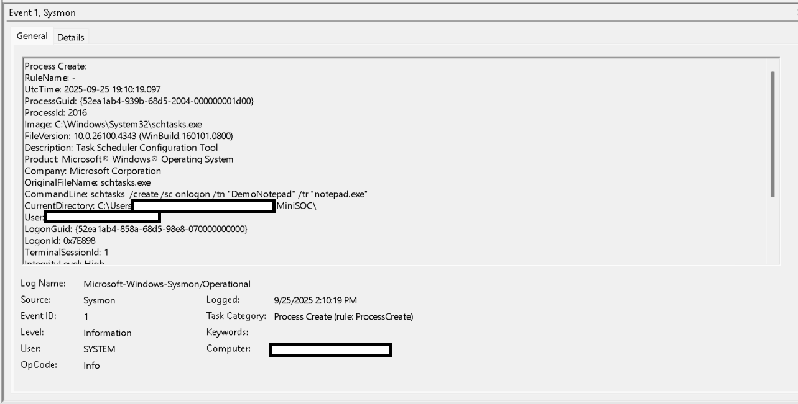
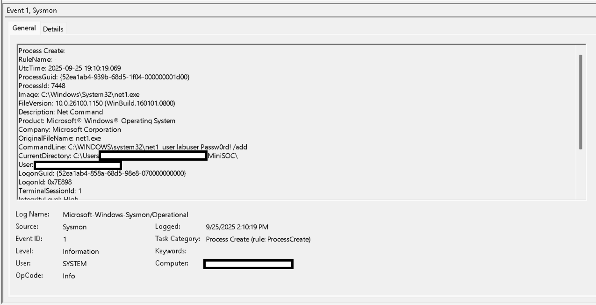

# Findings — Mini-SOC on Windows 11 Home

## Summary
One-host SOC exercise using Sysmon with the SwiftOnSecurity baseline on Windows 11 Home.

**Simulated benign activity**
- Local user creation
- Scheduled task creation
- Certutil file download

> Note: No admin group modification was performed in this lab run.

---

## Finding 1 — Ingress Tool Transfer
- **MITRE Technique:** [T1105 — Ingress Tool Transfer](https://attack.mitre.org/techniques/T1105/)
- **Event ID:** 1 (Sysmon — Process Create)
- **Executable:** `certutil.exe`
- **CommandLine:** `certutil -urlcache -f https://example.com C:\MiniSOC\logs\example.txt`
- **Evidence:** 
- **Notes:** `certutil` is a legitimate Windows tool often abused to download files. This was simulated safely.

---

## Finding 2 — Persistence via Scheduled Task
- **MITRE Technique:** [T1053.005 — Scheduled Task/Job: Scheduled Task](https://attack.mitre.org/techniques/T1053/005/)
- **Event ID:** 1 (Sysmon — Process Create)
- **Executable:** `schtasks.exe`
- **CommandLine:** `schtasks /create /sc onlogon /tn "DemoNotepad" /tr "notepad.exe"`
- **Evidence:** 
- **Notes:** A scheduled task was created to launch Notepad at logon. Attackers commonly use scheduled tasks for persistence.

---

## Finding 3 — Local Account Creation
- **MITRE Technique:** [T1136 — Create Account](https://attack.mitre.org/techniques/T1136/)
- **Event ID:** 1 (Sysmon — Process Create)
- **Executable:** `net1.exe`
- **CommandLine:** `net1 user labuser Passw0rd! /add`
- **Evidence:** 
- **Notes:** A standard local user `labuser` was created. **No administrator privileges were granted** and no group membership changes were made.

---

## Recommendations
- Review local accounts regularly and remove any that are unauthorized.
- Audit scheduled tasks for unknown or suspicious entries.
- Monitor Sysmon Event IDs **1** (Process Create) and **12/13/14** (Registry TaskCache writes) for persistence and LOLBIN activity (e.g., `certutil`, `powershell`, `bitsadmin`).
